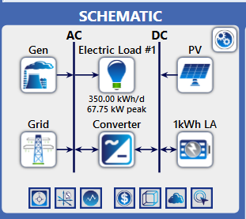
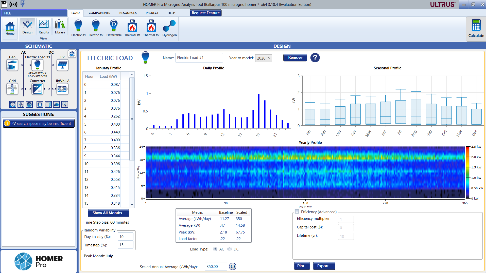
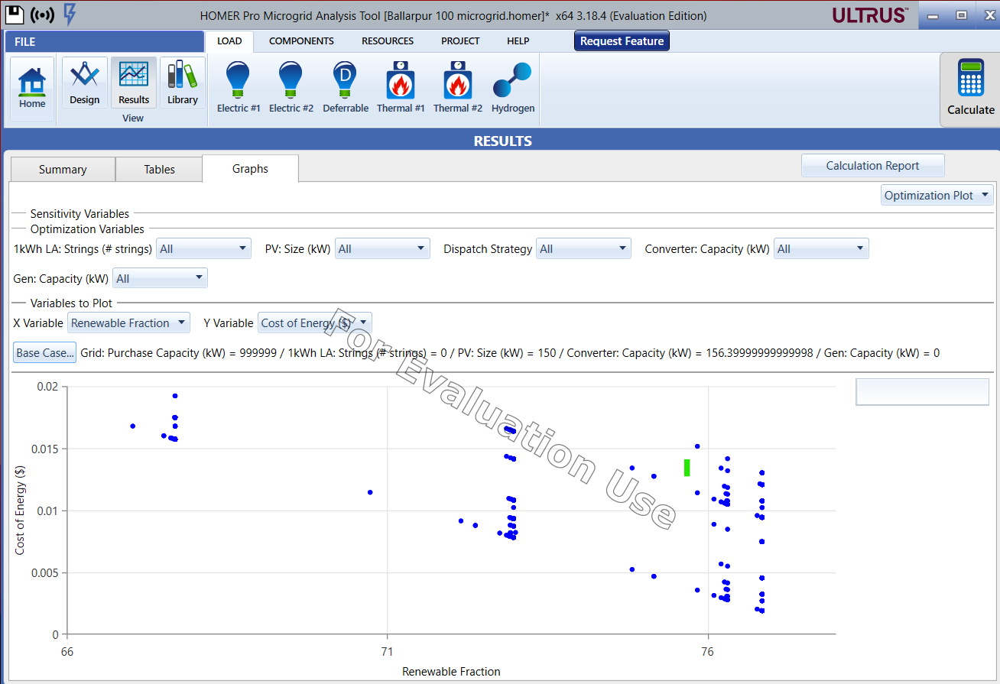
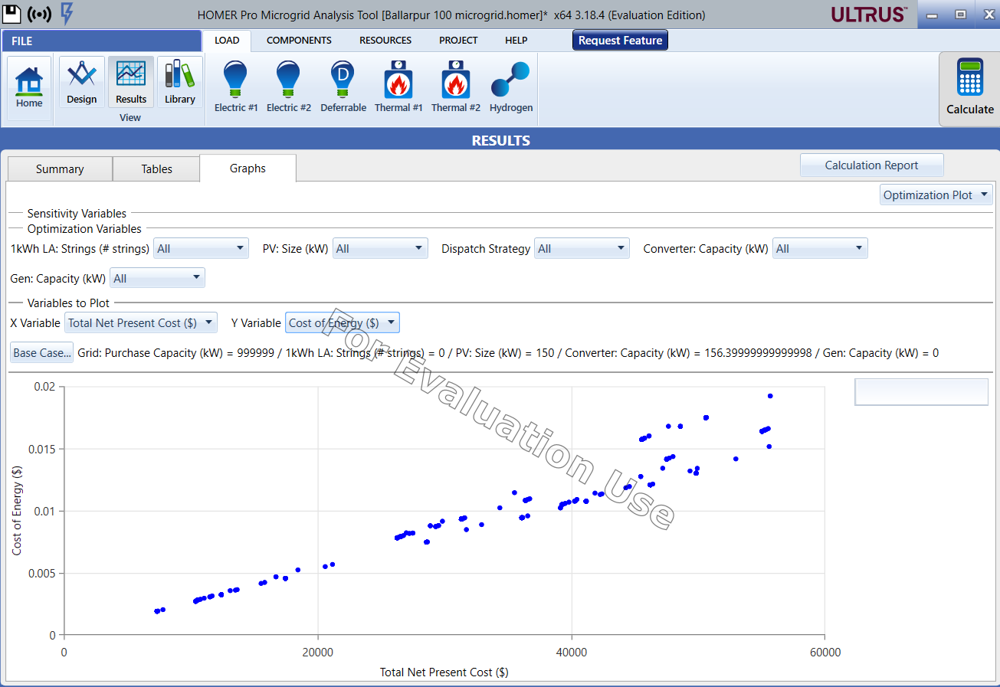

# ⚡ Microgrid Feasibility Study — Ballarpur, Maharashtra

## 📌 Overview
Designed and simulated a 150 kW solar hybrid microgrid for 100 households using HOMER Pro.

---

## ⚙️ System Architecture
The microgrid integrates solar PV, diesel generator, battery storage, and grid connection.

---

## ⚡ Load Profile
Represents daily and seasonal electricity demand patterns for the community.

---

## 📊 Key Results
- Renewable Fraction: **76.8%**
- LCOE: **$0.417/kWh**
- Project Lifetime: **25 years**

---

## 📈 Key Analysis

### 🌱 Renewable Fraction vs Cost of Energy
Shows trade-off between sustainability and cost.

---

### 💰 Net Present Cost vs Cost of Energy
Highlights economic optimization across configurations.

---

## 💡 Insights
- Higher renewable penetration reduces diesel dependency  
- Optimal configuration balances cost and sustainability  
- Solar + battery significantly improves system efficiency  

---

## 🛠 Tools Used
- HOMER Pro v3.18.4  
- NASA GHI Solar Data  

---

## 📍 Location
Ballarpur, Chandrapur (Maharashtra, India)
